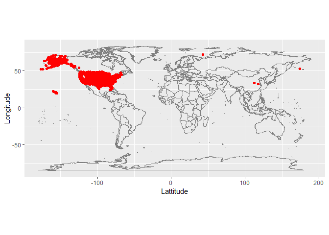

Case Study 04
================
Ehsan Ul Hoque Tanim
September 26, 2022

## Load Packages

``` r
library(tidyverse)
library(nycflights13)
library(maps)
library(ggplot2)
```

## Code

``` r
airports2 <- airports %>% 
  select(faa, name)%>%
  rename(dest = faa)

flights2 <- flights %>%
  select(dest,origin, distance)

farthest_airport <- flights2 %>% 
  left_join(airports2, by= "dest") %>%
  arrange(desc(distance)) %>% slice(1)
```

## Farthest airport from NYC

``` r
farthest_airport
```

    ## # A tibble: 1 × 4
    ##   dest  origin distance name         
    ##   <chr> <chr>     <dbl> <chr>        
    ## 1 HNL   JFK        4983 Honolulu Intl

## Introducing Spatial Data

``` r
airports %>%
  distinct(lon,lat) %>%
  ggplot(aes(lon, lat)) +
    borders("world") +
    geom_point(col="red") +
    labs(x="Lattitude",
         y="Longitude")+
    coord_quickmap()
```

<!-- -->
