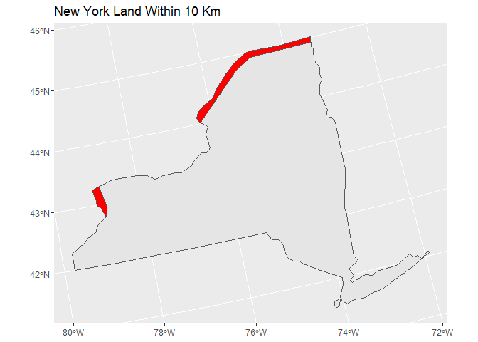

Case Study 05
================
Ehsan Ul Hoque Tanim
October 04, 2022

``` r
library(spData)
library(sf)
library(tidyverse)

data(world)
data(us_states)

albers = "+proj=aea +lat_1=29.5 +lat_2=45.5 +lat_0=37.5 +lon_0=-96 +x_0=0 +y_0=0 +ellps=GRS80 +datum=NAD83 +units=m +no_defs"

canada_border <- world %>% 
  st_transform(albers) %>%
  filter(name_long == "Canada") %>%
  st_buffer(dist = 10000)

NY <- us_states %>% 
  st_transform(albers) %>% 
  filter(NAME == "New York") 

Border = st_intersection(canada_border, NY)
```

    ## Warning: attribute variables are assumed to be spatially constant throughout all
    ## geometries

``` r
ggplot()+
  geom_sf(data = NY)+
  geom_sf(data = Border, fill = "red")+
  labs(title = "New York Land Within 10 Km")
```

<!-- -->
