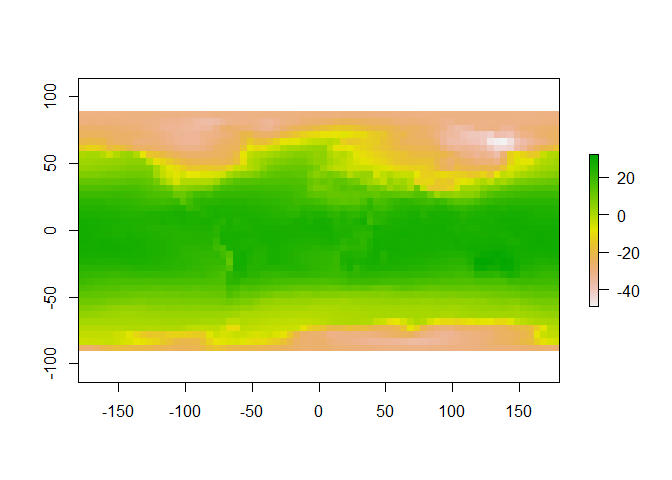
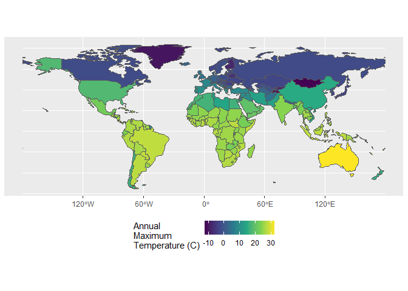

Case Study 06
================
Ehsan Ul Hoque Tanim
October 11, 2022

## Load Library

``` r
library(raster)
library(sp)
library(spData)
library(tidyverse)
library(sf)
library(ncdf4)
```

## Load ‘world’ data from spData package

``` r
download.file("https://crudata.uea.ac.uk/cru/data/temperature/absolute.nc","crudata.nc",method = "curl")
tmean = raster("crudata.nc")

nc = nc_open("crudata.nc")

world_sp <- world %>% 
  filter(name_long != "Antarctica") %>%
  as("Spatial")

plot(tmean)
```

<!-- -->

``` r
names(tmean) <- "tmax"

tmax_country <- tmean %>%
  raster::extract(y=world_sp, fun=max, na.rm=T, small=T, sp=T)%>% st_as_sf()

ggplot(tmax_country,aes(fill=tmax))+
  geom_sf()+
  scale_fill_viridis_c(name="Annual\nMaximum\nTemperature (C)")+
  theme(legend.position = 'bottom')
```

<!-- -->
