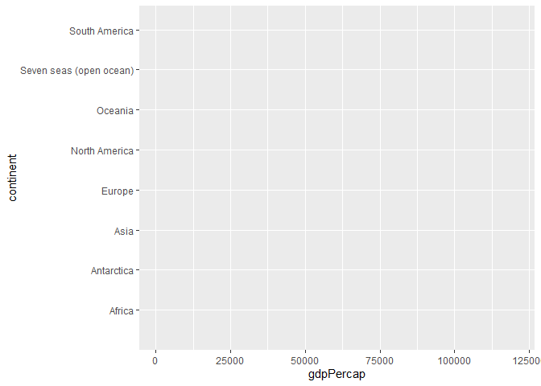

Case Study 07
================
Ehsan Ul Hoque Tanim
October 20, 2022

``` r
library(reprex)
library(sf)
library(tidyverse)
library(spData)
data("world")
```

``` r
ggplot(world,aes(x=gdpPercap, y=continent, color=continent))+
   geom_density(alpha=0.5,color=F)
```

    ## Warning: Removed 17 rows containing non-finite values (stat_density).

<!-- -->
