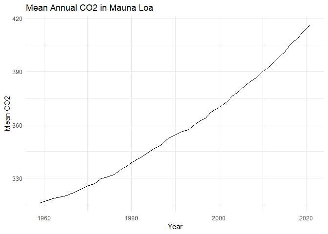

Case Study 08
================
Ehsan Ul Hoque Tanim
Ocober 25,2022

    ## 
    ## ── Column specification ──────────────────────────────
    ## cols(
    ##   year = col_double(),
    ##   mean = col_double(),
    ##   uncertainty = col_double()
    ## )

<!-- -->
<table>
<thead>
<tr>
<th style="text-align:right;">
year
</th>
<th style="text-align:right;">
mean
</th>
<th style="text-align:right;">
uncertainty
</th>
</tr>
</thead>
<tbody>
<tr>
<td style="text-align:right;">
2021
</td>
<td style="text-align:right;">
416.45
</td>
<td style="text-align:right;">
0.12
</td>
</tr>
<tr>
<td style="text-align:right;">
2020
</td>
<td style="text-align:right;">
414.24
</td>
<td style="text-align:right;">
0.12
</td>
</tr>
<tr>
<td style="text-align:right;">
2019
</td>
<td style="text-align:right;">
411.66
</td>
<td style="text-align:right;">
0.12
</td>
</tr>
<tr>
<td style="text-align:right;">
2018
</td>
<td style="text-align:right;">
408.72
</td>
<td style="text-align:right;">
0.12
</td>
</tr>
<tr>
<td style="text-align:right;">
2017
</td>
<td style="text-align:right;">
406.76
</td>
<td style="text-align:right;">
0.12
</td>
</tr>
</tbody>
</table>
