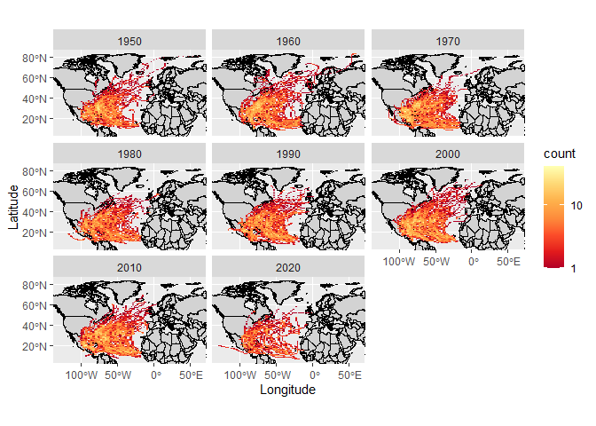

Case Study 09
================
Your Name
August 1, 2020

``` r
library(sf)
library(tidyverse)
library(ggmap)
library(rnoaa)
```

    ## Warning: package 'rnoaa' was built under R version 4.2.2

``` r
library(spData)
data(world)
data(us_states)

# comment
dataurl = "https://www.ncei.noaa.gov/data/international-best-track-archive-for-climate-stewardship-ibtracs/v04r00/access/shapefile/IBTrACS.NA.list.v04r00.points.zip"
tdir = tempdir()
download.file(dataurl, destfile = file.path(tdir, "temp.zip"))
unzip(file.path(tdir, "temp.zip"), exdir = tdir)
list.files(tdir)
```

    ## [1] "file78a823286503"                  "IBTrACS.NA.list.v04r00.points.dbf"
    ## [3] "IBTrACS.NA.list.v04r00.points.prj" "IBTrACS.NA.list.v04r00.points.shp"
    ## [5] "IBTrACS.NA.list.v04r00.points.shx" "temp.zip"

``` r
storm_data <- read_sf(list.files(tdir, pattern=".shp", full.names = T))

storms <- storm_data %>% 
  filter(SEASON >= 1950) %>% 
  mutate_if(is.numeric, function(x) ifelse(x==-999.0, NA, x)) %>% 
  mutate(decade=(floor(year/10)*10))

region <- st_bbox(storm_data)

World <- map_data("world")
ggplot(storms) + 
  geom_map(
    data = World, map = World,
    aes(map_id = region),
    color = "black", fill = "lightgray", size  =0.1
  ) + 
  stat_bin2d(aes(y = st_coordinates(storms)[,2],
                 x = st_coordinates(storms)[,1]),
             bins = 100) +
  facet_wrap(~decade) + 
  scale_fill_distiller(palette = "YlOrRd", trans = "log", direction = -1, breaks = c(1, 10, 100, 1000)) + 
  coord_sf(ylim = region[c(2,4)], xlim = region[c(1,3)]) +   xlab("Longitude") + 
  ylab("Latitude")
```

<!-- -->

``` r
states <- us_states %>% 
  st_transform(st_crs(storms)) %>% 
  rename(state = NAME)

storm_states <- st_join(storms, states, join = st_intersects, left = F)
storm_states %>% 
  group_by(state) %>% 
  summarize(storms = length(unique(NAME))) %>% 
  arrange(desc(storms)) %>% 
  slice(1:5)
```

    ## Simple feature collection with 5 features and 2 fields
    ## Geometry type: MULTIPOINT
    ## Dimension:     XY
    ## Bounding box:  xmin: -106.4 ymin: 24.6 xmax: -75.9 ymax: 36.55
    ## Geodetic CRS:  WGS 84
    ## # A tibble: 5 × 3
    ##   state          storms                                                 geometry
    ##   <chr>           <int>                                         <MULTIPOINT [°]>
    ## 1 Florida            87 ((-86.94 30.95), (-87.21 30.92), (-87.44 30.89), (-87.5…
    ## 2 North Carolina     66 ((-81.66 36.55), (-81.99 36), (-82 35.8), (-81.7 35.9),…
    ## 3 Georgia            59 ((-83.12 34.34), (-83.5 34.5), (-83.28 34.65), (-84.21 …
    ## 4 Texas              54 ((-94.09 33.48), (-94.9 33.5), (-94.56 33.36), (-94.5 3…
    ## 5 Louisiana          52 ((-90.6 29.4), (-90.5 29.4), (-90.3 29.3), (-90.29 29.2…
