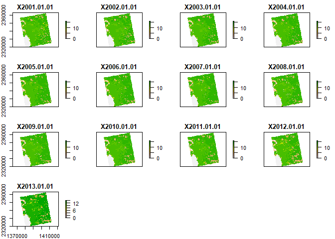
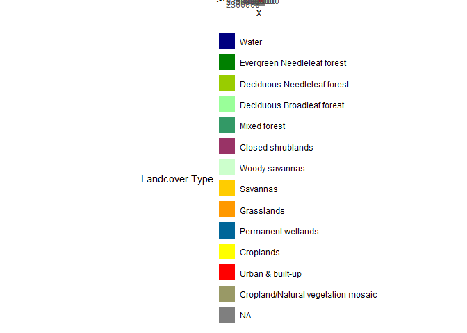
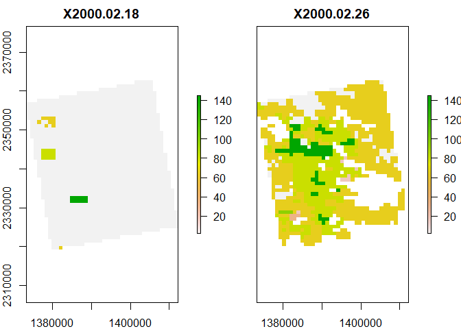
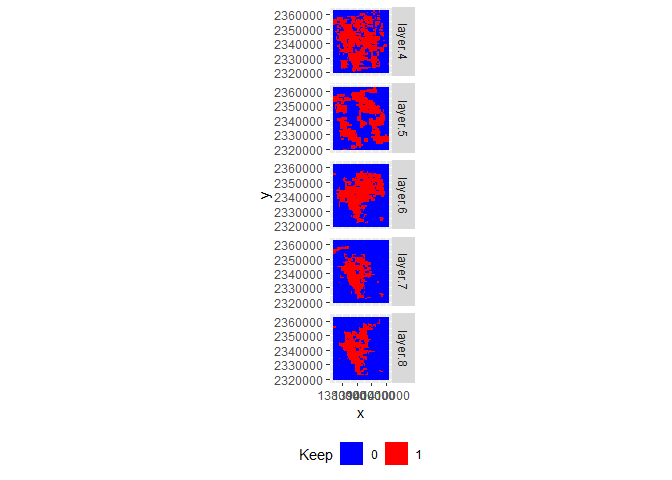
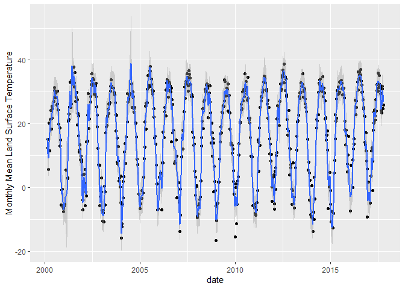
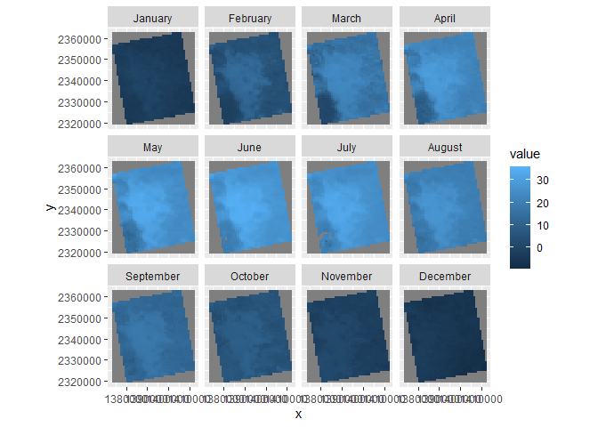
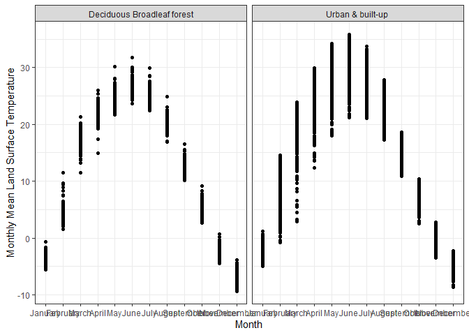

Case Study 10
================
Your Name
August 1, 2020

    ## Warning: package 'rasterVis' was built under R version 4.2.2

    ## Warning in .getCRSfromGridMap4(atts): cannot process these parts of the crs:
    ## _CoordinateAxisTypes=GeoX GeoY
    ## horizontal_datum_name=WGS84

    ## Warning in .doTime(r, nc, zvar, dim3): assuming a standard calender:julian

    ## Warning in .doTime(st, nc, zvar, dim3): assuming a standard calender:julian

    ## Warning in .getCRSfromGridMap4(atts): cannot process these parts of the crs:
    ## _CoordinateAxisTypes=GeoX GeoY
    ## horizontal_datum_name=WGS84

    ## Warning in .doTime(r, nc, zvar, dim3): assuming a standard calender:julian

    ## Warning in .doTime(st, nc, zvar, dim3): assuming a standard calender:julian

<!-- --><!-- --><!-- --><!-- --><!-- -->

    ## Warning in .getCRSfromGridMap4(atts): cannot process these parts of the crs:
    ## _CoordinateAxisTypes=GeoX GeoY
    ## horizontal_datum_name=WGS84

    ## Warning in .doTime(r, nc, zvar, dim3): assuming a standard calender:julian

    ## Warning in .doTime(st, nc, zvar, dim3): assuming a standard calender:julian

<!-- --><!-- -->

    ## Warning: Removed 151 rows containing non-finite values (stat_smooth).

    ## Warning in simpleLoess(y, x, w, span, degree = degree, parametric =
    ## parametric, : k-d tree limited by memory. ncmax= 660

    ## Warning in predLoess(object$y, object$x, newx = if
    ## (is.null(newdata)) object$x else if (is.data.frame(newdata))
    ## as.matrix(model.frame(delete.response(terms(object)), : k-d tree limited by
    ## memory. ncmax= 660

    ## Warning: Removed 151 rows containing missing values (geom_point).

<!-- --><!-- --><!-- -->
