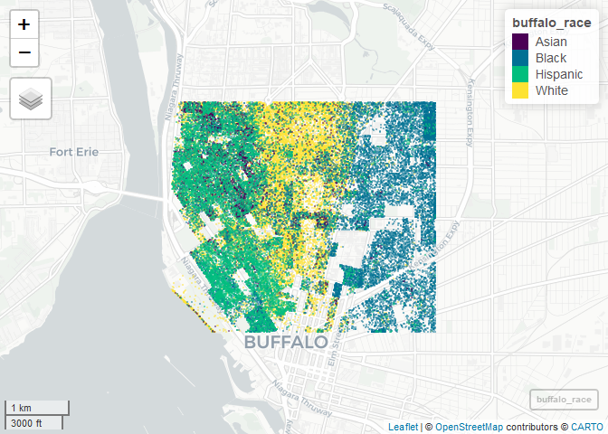

Case Study 11
================
Ehsan Ul Hoque Tanim
November 15, 2022

``` r
library(tidyverse)
library(spData)
library(sf)
library(mapview)
```

    ## Warning: package 'mapview' was built under R version 4.2.2

``` r
library(foreach)
```

    ## Warning: package 'foreach' was built under R version 4.2.2

``` r
library(doParallel)
```

    ## Warning: package 'doParallel' was built under R version 4.2.2

    ## Warning: package 'iterators' was built under R version 4.2.2

``` r
registerDoParallel(4)
getDoParWorkers()
```

    ## [1] 4

``` r
library(tidycensus)
```

    ## Warning: package 'tidycensus' was built under R version 4.2.2

``` r
census_api_key("14e390f2c960887e1a905d2d6d768190f715a3d5")

library(tidycensus)
racevars <- c(White = "P005003", 
              Black = "P005004", 
              Asian = "P005006", 
              Hispanic = "P004003")

options(tigris_use_cache = TRUE)
erie <- get_decennial(geography = "block", variables = racevars, 
                  state = "NY", county = "Erie County", geometry = TRUE,
                  summary_var = "P001001", cache_table=T) 
cropped_data <- st_crop (erie, xmin=-78.9,xmax=-78.85,ymin=42.888,ymax=42.92)                  
```

    ## Warning: attribute variables are assumed to be spatially constant throughout all
    ## geometries

``` r
race = unique(cropped_data$variable)

foreach(race, i=1:4, .combine = "rbind") %do%
  race[i]
```

    ##          [,1]      
    ## result.1 "White"   
    ## result.2 "Black"   
    ## result.3 "Asian"   
    ## result.4 "Hispanic"

``` r
buffalo_race <- foreach(i=1:4, .combine = "rbind") %do% {
  cropped_data %>% 
    filter(variable == race[i]) %>% 
    st_sample(size = .$value) %>% 
    st_as_sf() %>% 
    mutate(variable = race[i])
}

mapview(buffalo_race, 
        cex = 1, 
        alpha = 0)  
```

<!-- -->
